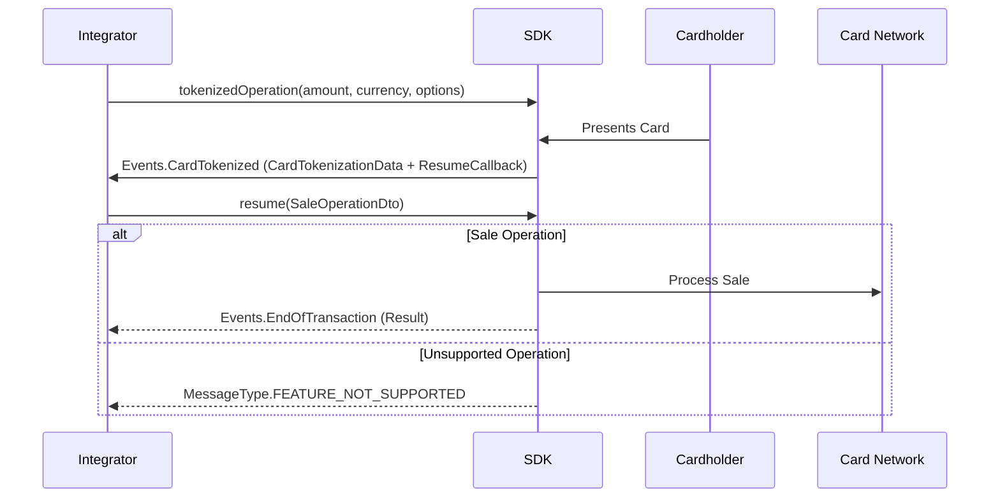
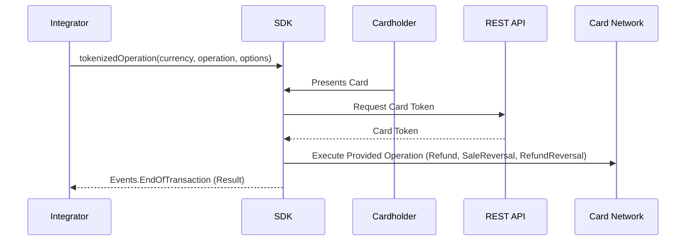

# Transaction Types


## Sale{#2}

`Sale`

A sale initiates a payment operation to the card reader. In it's simplest form you only have to pass the amount and currency but it also accepts tip configuration and a map with extra parameters.


**Parameters**


| Parameter      | Notes |
| ----------- | ----------- |
| `amount` <span class="badge badge--primary">Required</span>  <br />*BigInteger*    | Amount of funds to charge - in the minor unit of currency (f.ex. 1000 is 10.00 GBP)|
| `currency` <span class="badge badge--primary">Required</span> <br />[*Currency*](androidobjects.md#13)     | Currency of the charge|
| `options` <br />[*SaleOptions*](androidobjects.md#4)      | An object to store all the customization options for a sale ([Tip Configuration](androidobjects.md#39), [Metadata](androidobjects.md#metadata), [Money Remittance Options](androidobjects.md#money-remittance-options),...)|

**Code example**

```java
//Initiate a sale for 10.00 in Great British Pounds
api.sale(new BigInteger("1000"),Currency.GBP);

//Initiate a sale for 10.00 in Great British Pounds with a tipping configuration
//This feature is only available for PAX and Telpo devices
TipConfiguration tipConfiguration = new TipConfiguration();
tipConfiguration.setTipPercentages(Arrays.asList(5, 10, 15, 20));
tipConfiguration.setTipAmount(new BigInteger("1000"));
tipConfiguration.setBaseAmount(new BigInteger("1000"));
tipConfiguration.setEnterAmountEnabled(true);
tipConfiguration.setFooter("Thank you");
tipConfiguration.setSkipEnabled(true);
// Metadata
Metadata metadata = new Metadata("Data 1", "Data 2", "Data 3", "Data 4", "Data 5");

SaleOptions options = new SaleOptions();
options.setTipConfiguration(tipConfiguration);
options.setMetadata(metadata);

api.sale(new BigInteger("1000"),Currency.GBP, options);


//Initiate a sale for 10.00 USD using Money Remitance options
MoneyRemittanceOptions moneyRemittanceOptions = new MoneyRemittanceOptions("John Doe", CountryCode.USA);
SaleOptions saleOptions = new SaleOptions(true, moneyRemittanceOptions);

api.sale(new BigInteger("1000"), Currency.USD, saleOptions);
```

**Events invoked**

[**currentTransactionStatus**](androideventlisteners.md#14)

Invoked during a transaction, it fetches statuses coming from the terminal (ex : 'waiting for card' or 'waiting for PIN entry').
***

[**signatureRequired**](androideventlisteners.md#15)

Invoked if card verification requires signature.
***

[**endOfTransaction**](androideventlisteners.md#16)

Invoked when the terminal finishes processing the transaction.
***

**Returns**

| Parameter      | Notes |
| ----------- | ----------- |
| *[OperationStartResult](androidobjects.md#OperationStartResult)*| Object containing information about the financial operation started. Most specifically the `transactionReference` which **must** be saved on your end in case you do not get back the transaction result object at the end of the transaction. The `transactionReference` will allow you to query the Handpoint Gateway directly to know the outcome of the transaction in case it is not delivered as planned by the terminal at the end of the transaction.|


## Sale And Tokenize Card{#3}

A [sale](#2) operation which also returns a card token. (not available for all acquirers, please check with Handpoint to know if tokenization is supported for your acquirer of choice)

**Parameters**


| Parameter      | Notes |
| ----------- | ----------- |
| `amount` <span class="badge badge--primary">Required</span>  <br />*BigInteger*     | Amount of funds to charge - in the minor unit of currency (f.ex. 1000 is 10.00 GBP)|
| `currency` <span class="badge badge--primary">Required</span> <br />[*Currency*](androidobjects.md#13)     | Currency of the charge|
| `options` <br />[*SaleAndTokenizeOptions*](androidobjects.md#sale-and-tokenize-options)     | An object to store all the customization options for a sale ([Tip Configuration](androidobjects.md#39), [Money Remittance Options](androidobjects.md#money-remittance-options),...)|

**Code example**

```java
//Initiate a sale for 10.00 in Great British Pounds
SaleOptions options = new SaleAndTokenizeOptions();
api.sale(new BigInteger("1000"),Currency.GBP, options);


//Initiate a sale for 10.00 in Great British Pounds with a tipping configuration
//This feature is only available for PAX and Telpo devices

TipConfiguration tipConfiguration = new TipConfiguration();
tipConfiguration.setTipPercentages(Arrays.asList(5, 10, 15, 20));
tipConfiguration.setTipAmount(new BigInteger("1000"));
tipConfiguration.setBaseAmount(new BigInteger("1000"));
tipConfiguration.setEnterAmountEnabled(true);
tipConfiguration.setFooter("Thank you");
tipConfiguration.setSkipEnabled(true);
SaleOptions options = new SaleOptions();
options.setTipConfiguration(tipConfiguration);
options.toSaleAndTokenizeOptions();

api.sale(new BigInteger("1000"),Currency.GBP,options);

//Initiate a sale for 10.00 USD using Money Remitance options
MoneyRemittanceOptions moneyRemittanceOptions = new MoneyRemittanceOptions("John Doe", CountryCode.USA);
SaleAndTokenizeOptions saleAndTokenizeOptions= new SaleAndTokenizeOptions(moneyRemittanceOptions);

api.sale(new BigInteger("1000"), Currency.USD, saleAndTokenizeOptions);
```

**Events invoked**

[**currentTransactionStatus**](androideventlisteners.md#14)

Invoked during a transaction, it fetches statuses coming from the terminal (ex : 'waiting for card' or 'waiting for PIN entry').
***

[**signatureRequired**](androideventlisteners.md#15)

Invoked if card verification requires signature.
***

[**endOfTransaction**](androideventlisteners.md#16)

Invoked when the terminal finishes processing the transaction.
***

 **Returns**

| Parameter      | Notes |
| ----------- | ----------- |
| *[OperationStartResult](androidobjects.md#OperationStartResult)*| Object containing information about the financial operation started. Most specifically the `transactionReference` which **must** be saved on your end in case you do not get back the transaction result object at the end of the transaction. The `transactionReference` will allow you to query the Handpoint Gateway directly to know the outcome of the transaction in case it is not delivered as planned by the terminal at the end of the transaction.|


## Sale Reversal{#4}

`saleReversal`

A sale reversal, also called sale VOID allows the user to reverse a previous sale operation. This operation reverts (if possible) a specific sale identified with a transaction id. In its simplest form you only have to pass the amount, currency and originalTransactionID but it also accepts a map with extra parameters. Note that transactions can only be reversed within a 24 hours timeframe or until the daily batch of transactions has been sent for submission.

**Parameters**


| Parameter        | Notes |
| ----------- | ----------- |
| `amount` <span class="badge badge--primary">Required</span>  <br />*BigInteger*     | Amount of funds to charge - in the minor unit of currency (f.ex. 1000 is 10.00 GBP)|
| `currency` <span class="badge badge--primary">Required</span> <br />[*Currency*](androidobjects.md#13)     | Currency of the charge|
| `originalTransactionID` <span class="badge badge--primary">Required</span> <br />*String*     | Id of the original sale transaction|
| `options` <br />[*SaleOptions*](androidobjects.md#4)     | An object to store all the customization options for a sale.|

**Code example**

```java
//Initiate a reversal for 10.00 in Great British Pounds
api.saleReversal(new BigInteger("1000"),Currency.GBP,"00000000-0000-0000-0000-000000000000");
```

**Events invoked**

[**currentTransactionStatus**](androideventlisteners.md#14)

Invoked during a transaction, it fetches statuses coming from the terminal (ex : 'waiting for card' or 'waiting for PIN entry').
***

[**signatureRequired**](androideventlisteners.md#15)

Invoked if card verification requires signature.
***

[**endOfTransaction**](androideventlisteners.md#16)

Invoked when the terminal finishes processing the transaction.
***

**Returns**

| Parameter      | Notes |
| ----------- | ----------- |
| *[OperationStartResult](androidobjects.md#OperationStartResult)*| Object containing information about the financial operation started. Most specifically the `transactionReference` which **must** be saved on your end in case you do not get back the transaction result object at the end of the transaction. The `transactionReference` will allow you to query the Handpoint Gateway directly to know the outcome of the transaction in case it is not delivered as planned by the terminal at the end of the transaction.|


## Refund{#5}

`refund`

A refund operation moves funds from the merchant account to the cardholder´s credit card. In it's simplest form you only have to pass the amount and currency but it also accepts a map with extra parameters. Note that a card is required to be swiped, dipped or tapped for this operation. For Interac (Canadian Debit Network), refunds can only be processed until Interac closes the batch of transactions at night.

**Parameters**


| Parameter      | Notes |
| ----------- | ----------- |
| `amount` <span class="badge badge--primary">Required</span>  <br />*BigInteger*     | Amount of funds to charge - in the minor unit of currency (f.ex. 1000 is 10.00 GBP)|
| `currency` <span class="badge badge--primary">Required</span> <br />[*Currency*](androidobjects.md#13)     | Currency of the charge|
| `originalTransactionID` <br />*String*     | If present it links the refund with a previous sale. It effectively limits the maximum amount refunded to that of the original transaction.|
| `options` <br />[*RefundOptions*](androidobjects.md#6)     | An object to store all the customization options for a refund ([Metadata](androidobjects.md#metadata), [Money Remittance Options](androidobjects.md#money-remittance-options),...)|

**Code example**

```java
//Initiate a refund for 10.00 in Great British Pounds (Linked Refund)
api.refund(new BigInteger("1000"),Currency.GBP,"00000000-0000-0000-0000-000000000000");

//Initiate a refund for 10.00 USD using Money Remitance options (Linked Refund)
MoneyRemittanceOptions moneyRemittanceOptions = new MoneyRemittanceOptions("John Doe", CountryCode.USA);
RefundOptions refundOptions= new RefundOptions(true, moneyRemittanceOptions);

api.refund(new BigInteger("1000"), Currency.GBP, "00000000-0000-0000-0000-000000000000", refundOptions);
```

** Events invoked**

[**currentTransactionStatus**](androideventlisteners.md#14)

Invoked during a transaction, it fetches statuses coming from the terminal (ex : 'waiting for card' or 'waiting for PIN entry')
***

[**signatureRequired**](androideventlisteners.md#15)

Invoked if card verification requires signature.
***

[**endOfTransaction**](androideventlisteners.md#16)

Invoked when the terminal finishes processing the transaction
***

**Returns**

| Parameter      | Notes |
| ----------- | ----------- |
| *[OperationStartResult](androidobjects.md#OperationStartResult)*| Object containing information about the financial operation started. Most specifically the `transactionReference` which **must** be saved on your end in case you do not get back the transaction result object at the end of the transaction. The `transactionReference` will allow you to query the Handpoint Gateway directly to know the outcome of the transaction in case it is not delivered as planned by the terminal at the end of the transaction.|


## Automatic Refund

`automaticRefund`

A refund operation moves funds from the merchant account to the cardholder's credit card. This operation allows you to refund a card automatically without requiring the cardholder to dip/tap/swipe his card.  In its simplest form you only have to pass the Original Transaction ID (GUID) to this function. The amount to be refunded will be the same amount as the one of the original sale. 

**Parameters**


| Parameter      | Notes |
| ----------- | ----------- |
| `originalTransactionID`  <span class="badge badge--primary">Required</span><br />*String*      | Links the automatic refund with a previous sale. The amount refunded will be the same as the one of the original transaction.|
| `options` <br />[*MoToOptions*](androidobjects.md#moto-options)      | An object to store optional parameters for a MoTo refund ([MoTo Channel](androidobjects.md#moto-channel), [Money Remittance Options](androidobjects.md#money-remittance-options),...)|

**Code example**

```java
//Initiate an automatic refund
api.automaticRefund("00000000-0000-0000-0000-000000000000");

//Initiate an automatic refund using MoTo Options
MoToOptions moToOptions = new MoToOptions();
moToOptions.setChannel(MoToChannel.TO);

api.automaticRefund("00000000-0000-0000-0000-000000000000", moToOptions);
```

** Events invoked**

[**currentTransactionStatus**](androideventlisteners.md#14)

Invoked during a transaction, it fetches statuses coming from the terminal (ex : 'waiting for card' or 'waiting for PIN entry')
***

[**endOfTransaction**](androideventlisteners.md#16)

Invoked when the terminal finishes processing the transaction
***

**Returns**

| Parameter      | Notes |
| ----------- | ----------- |
| *[OperationStartResult](androidobjects.md#OperationStartResult)*| Object containing information about the financial operation started. Most specifically the `transactionReference` which **must** be saved on your end in case you do not get back the transaction result object at the end of the transaction. The `transactionReference` will allow you to query the Handpoint Gateway directly to know the outcome of the transaction in case it is not delivered as planned by the terminal at the end of the transaction.|


## Automatic Partial Refund

`automaticRefund`

A refund operation moves funds from the merchant account to the cardholder's credit card. This operation allows you to PARTIALLY refund a card automatically without requiring the cardholder to dip/tap/swipe his card.  In its simplest form you only have to pass the amount, currency and the Original Transaction ID (GUID). Note that the amount can not go above the amount of the original sale. If a refund is attempted for an amount higher than the one of the original sale, the transaction will be automatically declined. 


**Parameters**


| Parameter      | Notes |
| ----------- | ----------- |
| `amount` <span class="badge badge--primary">Required</span>  <br />*BigInteger*     | Amount of funds to refund - in the minor unit of currency (f.ex. 1000 is 10.00 GBP)|
| `currency` <span class="badge badge--primary">Required</span> <br />[*Currency*](androidobjects.md#13)     | Currency of the refund|
| `originalTransactionID` <span class="badge badge--primary">Required</span> <br />*String*     | Links the refund with a previous sale. It effectively limits the maximum amount refunded to that of the original transaction.|
| `options` <br />[*MoToOptions*](androidobjects.md#moto-options)      | An object to store optional parameters for a MoTo refund ([MoTo Channel](androidobjects.md#moto-channel), [Money Remittance Options](androidobjects.md#money-remittance-options),...)|

**Code example**

```java
//Initiate an automatic partial refund for 5.00 Great British Pounds
api.automaticRefund(new BigInteger("500"),Currency.GBP,"00000000-0000-0000-0000-000000000000");

//Initiate an automatic partial refund for 5.00 Great British Pounds using MoTo Options
MoToOptions moToOptions = new MoToOptions();
moToOptions.setChannel(MoToChannel.MO);

api.automaticRefund(new BigInteger("500"),Currency.GBP,"00000000-0000-0000-0000-000000000000", moToOptions);
```

** Events invoked**

[**currentTransactionStatus**](androideventlisteners.md#14)

Invoked during a transaction, it fetches statuses coming from the terminal (ex : 'waiting for card' or 'waiting for PIN entry')
***


[**endOfTransaction**](androideventlisteners.md#16)

Invoked when the terminal finishes processing the transaction
***

**Returns**

| Parameter      | Notes |
| ----------- | ----------- |
| *[OperationStartResult](androidobjects.md#OperationStartResult)*| Object containing information about the financial operation started. Most specifically the `transactionReference` which **must** be saved on your end in case you do not get back the transaction result object at the end of the transaction. The `transactionReference` will allow you to query the Handpoint Gateway directly to know the outcome of the transaction in case it is not delivered as planned by the terminal at the end of the transaction.|


## Refund reversal{#6}

`refundReversal`

A refund reversal, also called refund VOID allows the merchant to reverse a previous refund operation. This operation reverts (if possible) a specific refund identified with a transaction id. In it's simplest form you only have to pass the amount, currency and originalTransactionID but it also accepts a map with extra parameters. Note that transactions can only be reversed within a 24 hours timeframe or until the daily batch of transactions has been sent for submission.

**Parameters**


| Parameter      | Notes |
| ----------- | ----------- |
| `amount` <span class="badge badge--primary">Required</span>  <br />*BigInteger*     | Amount of funds to charge - in the minor unit of currency (f.ex. 1000 is 10.00 GBP)|
| `currency` <span class="badge badge--primary">Required</span> <br />[*Currency*](androidobjects.md#13)     | Currency of the charge|
| `originalTransactionID` <span class="badge badge--primary">Required</span> <br />*String*     | transaction id of the original refund|
| `options` <br />[*SaleOptions*](androidobjects.md#4)     | An object to store all the customization options for the transaction.|

**Code example**

```java
//Initiate a refund reversal for 10.00 in Great British Pounds
api.refundReversal(new BigInteger("1000"),Currency.GBP,"00000000-0000-0000-0000-000000000000");
```

**Events invoked**

[**currentTransactionStatus**](androideventlisteners.md#14)

Invoked during a transaction, it fetches statuses coming from the terminal (ex : 'waiting for card' or 'waiting for PIN entry').
***

[**signatureRequired**](androideventlisteners.md#15)

Invoked if card verification requires signature.
***

[**endOfTransaction**](androideventlisteners.md#16)

Invoked when the terminal finishes processing the transaction.
***

**Returns**

| Parameter      | Notes |
| ----------- | ----------- |
| *[OperationStartResult](androidobjects.md#OperationStartResult)*| Object containing information about the financial operation started. Most specifically the `transactionReference` which **must** be saved on your end in case you do not get back the transaction result object at the end of the transaction. The `transactionReference` will allow you to query the Handpoint Gateway directly to know the outcome of the transaction in case it is not delivered as planned by the terminal at the end of the transaction.|


## MoTo Sale{#7}

`MoToSale`

Mail Order /Telephone Order (MOTO) sale. MOTO is a type of card-not-present (CNP) transaction in which services are paid and delivered via telephone, mail, fax, or internet communication. MOTO has become synonymous with any financial transaction where the entity taking payment does not physically see the card used to make the purchase.


**Parameters**


| Parameter      | Notes |
| ----------- | ----------- |
| `amount` <span class="badge badge--primary">Required</span>  <br />*BigInteger*    | Amount of funds to charge - in the minor unit of currency (f.ex. 1000 is 10.00 GBP)|
| `currency` <span class="badge badge--primary">Required</span> <br />[*Currency*](androidobjects.md#13)     | Currency of the charge|
| `options` <br />[*MoToOptions*](androidobjects.md#moto-options)      | An object to store optional parameters for a MoTo sale ([MoTo Channel](androidobjects.md#moto-channel), [Money Remittance Options](androidobjects.md#money-remittance-options),...)|

**Code example**

```java
//Initiate a MoTo sale for 10.00 in Great British Pounds
MoToOptions options = new MoToOptions();
options.setCustomerReference("MoTo Sale Example");

api.motoSale(new BigInteger("1000"), Currency.EUR, options);

//Initiate a MoTo sale for 10.00 USD using Money Remitance options
MoneyRemittanceOptions moneyRemittanceOptions = new MoneyRemittanceOptions("Test Integration", CountryCode.USA);
MoToOptions moToOptions = new MoToOptions(moneyRemittanceOptions);

api.motoSale(new BigInteger("1000"), Currency.USD, moToOptions);

```

**Events invoked**

[**currentTransactionStatus**](androideventlisteners.md#14)

Invoked during a transaction,  it fetches statuses coming from the sdk (ex : 'processing').

***

[**endOfTransaction**](androideventlisteners.md#16)

Invoked when the terminal finishes processing the transaction.
***

**Returns**

| Parameter      | Notes |
| ----------- | ----------- |
| *[OperationStartResult](androidobjects.md#OperationStartResult)*| Object containing information about the financial operation started.|


## MoTo Refund{#8}

`moToRefund`

A MOTO refund operation moves funds from the merchant account to the cardholder´s credit card. In it's simplest form you only have to pass the amount and currency but it also accepts the original transaction id. MOTO Refund is a type of card-not-present (CNP) transaction in which services are refunded via telephone, mail, fax, or internet communication. MOTO has become synonymous with any financial transaction where the entity taking payment does not physically see the card used to make the purchase or refund.


**Parameters**


| Parameter      | Notes |
| ----------- | ----------- |
| `amount` <span class="badge badge--primary">Required</span>  <br />*BigInteger*    | Amount of funds to charge - in the minor unit of currency (f.ex. 1000 is 10.00 GBP)|
| `currency` <span class="badge badge--primary">Required</span> <br />[*Currency*](androidobjects.md#13)     | Currency of the charge|
| `originalTransactionId` <br />*String*    | If present it links the refund with a previous sale. It effectively limits the maximum amount refunded to that of the original transaction.|
| `options` <br />[*MoToOptions*](androidobjects.md#moto-options)     | An object to store optional parameters for a MoTo refund ([MoTo Channel](androidobjects.md#moto-channel), [Money Remittance Options](androidobjects.md#money-remittance-options),...)|

**Code example**

```java
MoToOptions options = new MoToOptions();
options.setCustomerReference("MoTo Refund Example");

api.motoRefund(new BigInteger("1000"), Currency.EUR, "00000000-0000-0000-0000-000000000000",options);


//Initiate a MoTo refund for 10.00 USD using Money Remitance options
MoneyRemittanceOptions moneyRemittanceOptions = new MoneyRemittanceOptions("John Doe", CountryCode.USA);
MoToOptions moToOptions = new MoToOptions(moneyRemittanceOptions);

api.motoRefund(new BigInteger("1000"), Currency.USD,"00000000-0000-0000-0000-000000000000", moToOptions);
```
**Events invoked**

[**currentTransactionStatus**](androideventlisteners.md#14)

Invoked during a transaction,  it fetches statuses coming from the sdk (ex : 'processing').

***

[**endOfTransaction**](androideventlisteners.md#16)

Invoked when the terminal finishes processing the transaction.
***

**Returns**

| Parameter      | Notes |
| ----------- | ----------- |
| *[OperationStartResult](androidobjects.md#OperationStartResult)*| Object containing information about the financial operation started.|


## MoTo Reversal{#9}

`moToReversal`

A MOTO reversal, also called VOID allows the user to reverse a previous sale/refund operation. This operation reverts (if possible) a specific operation identified with a transaction id. Note that transactions can only be reversed within a 24 hours timeframe or until the daily batch of transactions has been sent for submission. MOTO Reversal is a type of card-not-present (CNP) transaction used to reverse a previous MOTO Sale or MOTO Refund.


**Parameters**


| Parameter      | Notes |
| ----------- | ----------- |
| `originalTransactionId` <span class="badge badge--primary">Required</span>  <br />*String*    | Id of the original sale transaction.|
| `options` <br />[*MoToOptions*](androidobjects.md#moto-options)       | An object to store optional parameters for a MoTo reversal.|

**Code example**

```java
MoToOptions options = new MoToOptions();
options.setCustomerReference("MoTo Reversal Example");

api.motoReversal("00000000-0000-0000-0000-000000000000",options);
```
**Events invoked**

[**currentTransactionStatus**](androideventlisteners.md#14)

Invoked during a transaction,  it fetches statuses coming from the sdk (ex : 'processing').

***

[**endOfTransaction**](androideventlisteners.md#16)

Invoked when the terminal finishes processing the transaction.
***

**Returns**

| Parameter      | Notes |
| ----------- | ----------- |
| *[OperationStartResult](androidobjects.md#OperationStartResult)*| Object containing information about the financial operation started.|


## MoTo Pre-Auth{#10}

`motoPreauthorization`

A MOTO pre-auth initiates a pre-authorization operation to the card reader. It's used to verify that the account is valid and has sufficient funds to cover a pending transaction, without actually debiting the cardholder's account upfront. 


**Parameters**


| Parameter      | Notes |
| ----------- | ----------- |
| `amount` <span class="badge badge--primary">Required</span>  <br />*BigInteger*    | Amount of funds to charge - in the minor unit of currency (f.ex. 1000 is 10.00 GBP)|
| `currency` <span class="badge badge--primary">Required</span> <br />[*Currency*](androidobjects.md#13)     | Currency of the charge|
| `options` <br />[*MoToOptions*](androidobjects.md#moto-options)      | An object to store optional parameters for a MoTo sale.|

**Code example**

```java
MoToOptions options = new MoToOptions();
options.setCustomerReference("MoTo Sale Example");

api.motoPreauthorization(new BigInteger("1000"), Currency.EUR, options);
```

**Events invoked**

[**currentTransactionStatus**](androideventlisteners.md#14)

Invoked during a transaction,  it fetches statuses coming from the sdk (ex : 'processing').

***

[**endOfTransaction**](androideventlisteners.md#16)

Invoked when the terminal finishes processing the transaction.
***

**Returns**

| Parameter      | Notes |
| ----------- | ----------- |
| *[OperationStartResult](androidobjects.md#OperationStartResult)*| Object containing information about the financial operation started.|

## Signature result

`signatureResult`

A signatureRequired event is invoked during a transaction when a signature verification is required (f.ex when a payment is done with a swiped or chip and sign card). The merchant is required to ask the cardholder for signature and approve (or decline) the signature. signatureResult tells the card reader if the signature was approved by passing the value true in the method. To decline a signature event then false should be passed to the card reader. Note that this event is only required for an HiLite or Hi5 integration and can be safely ignored for a PAX or Telpo integration.

**Parameters**


| Parameter      | Notes |
| ----------- | ----------- |
| `accepted` <span class="badge badge--primary">Required</span> <br />*Boolean*    | pass true if merchant accepts cardholder signature|

**Code example**

```java
//Approves signature automatically in signatureRequired event
@Override
public void signatureRequired(SignatureRequest signatureRequest, Device device){
	api.signatureResult(true);
}
```

**Events invoked**

[**currentTransactionStatus**](androideventlisteners.md#14)

Invoked during a transaction, it fetches statuses coming from the terminal (ex : 'waiting for card' or 'waiting for PIN entry').
***

[**endOfTransaction**](androideventlisteners.md#16)

Invoked when the terminal finishes processing the transaction.
***

**Returns**

| Parameter      | Notes |
| ----------- | ----------- |
|*[OperationStartResult](androidobjects.md#operation-start-result)*| Object containing information about the financial operation started. Most specifically the `transactionReference` which **must** be saved on your end in case you do not get back the transaction result object at the end of the transaction. The `transactionReference` will allow you to query the Handpoint Gateway directly to know the outcome of the transaction in case it is not delivered as planned by the terminal at the end of the transaction.|


## Tip Adjustment

`TipAdjustment`

A tip adjustment operation allows merchants to adjust the tip amount of a sale transaction before the batch of transactions is settled by the processor at the end of the day.
Note: This functionality is only available for the restaurant industry in the United States and the processors currently supporting this functionality are TSYS and VANTIV.

Dependencies:
The code example provided depends on RxJava, take a look a their documentation to see how to easily include this dependency in your android project. If you do not want to use RxJava or any additional dependencies then AsyncTask, provided by android, can be used instead for this asynchronous processing. Still we recommend using RxJava as it improves readability and maintainability.

**Parameters**


| Parameter      | Notes |
| ----------- | ----------- |
| `tipAmount` <span class="badge badge--primary">Required</span> <br />*BigDecimal*     | Tip amount added to the original (base) transaction amount - in the minor unit of currency (f.ex. 1000 is 10.00 GBP)|
| `originalTransactionID` <span class="badge badge--primary">Required</span> <br />*String*     | Unique id of the original sale transaction as received from the card reader (EFTTransactionID)|

**Code example**

```java
Observable.fromCallable(new Callable() {
	@Override
	public FinancialStatus call() throws Exception {
		return api.tipAdjustment(new BigDecimal(1000), "2bc23910-c3b3-11e6-9e62-07b2a5f091ec");
	}
})
.subscribeOn(Schedulers.io())
.observeOn(AndroidSchedulers.mainThread())
.subscribe(new Consumer() {
	@Override
	public void accept(@NonNull FinancialStatus status) throws Exception {
		if (status == FinancialStatus.AUTHORISED) {
			//SUCCESS
		} else if (status == FinancialStatus.DECLINED) {
			//DECLINED
		} else {
			//FAILED
	}
});
```

**Returns**


Result of the tip adjustment transaction, it returns a FinancialStatus, the possible values are :

| Parameter      | Notes |
| ----------- | ----------- |
| **FinancialStatus**| - **FinancialStatus.AUTHORISED** (tip adjustment approved by the processor) <br />  - **FinancialStatus.FAILED** (system error or timeout)<br /> - **FinancialStatus.DECLINED** (tip adjustment declined by the processor).|

If two tip adjustments are sent for the same sale transaction, the second tip adjustment will override the first one. In case the transaction fails (not declined) we recommend that you prompt the user of the POS to retry the adjustment.

## Tokenize Card{#12}

`tokenizeCard`

Returns a card token (not available for all acquirers, please check with Handpoint to know if tokenization is supported for your acquirer of choice)

**Parameters**


| Parameter      | Notes |
| ----------- | ----------- |
| `options` <br />[*SaleOptions*](androidobjects.md#4)     | An object to store all the customization options for the transaction.|

**Code example**

```java
//Tokenize a card
api.tokenizeCard();
```

**Events invoked**

[**currentTransactionStatus**](androideventlisteners.md#14)

Invoked during a transaction, it fetches statuses coming from the terminal (ex : 'waiting for card' or 'waiting for PIN entry').
***

[**endOfTransaction**](androideventlisteners.md#16)

Invoked when the terminal finishes processing the transaction.
***

**Returns**

| Parameter      | Notes |
| ----------- | ----------- |
| *[OperationStartResult](androidobjects.md#operation-start-result)*| Object containing information about the financial operation started. Most specifically the `transactionReference` which **must** be saved on your end in case you do not get back the transaction result object at the end of the transaction. The `transactionReference` will allow you to query the Handpoint Gateway directly to know the outcome of the transaction in case it is not delivered as planned by the terminal at the end of the transaction.|

## Tokenize And Modify
`tokenizedOperation`

A tokenize and modify operation allows you to start a financial operation for an initial amount, tokenize the card being dipped/tapped/swiped and modify the amount before the transaction is sent for processing. This operation is very useful for loyalty scenarios, a unique token for the card is delivered to your application in the middle of the transaction so you can lookup in your own loyalty engine if the cardholder qualifies for a discount. If the cardholder does qualify for a discount then the amount of the transaction can be modified (decreased) before the transaction is sent for processing. 

**Parameters**


| Parameter      | Notes |
| ----------- | ----------- |
| `currency` <span class="badge badge--primary">Required</span> <br />[*Currency*](androidobjects.md#13)| Currency of the charge|
| `operationDto` <span class="badge badge--primary">Required</span> <br />[*OperationDto*](androidobjects.md#operation-dto)| An object containing information about the financial operation being performed after the initial tokenization, if not specified it will default to "sale"|
| `options` <span class="badge badge--primary">Required</span><br />[*SaleOptions*](androidobjects.md#4) / [*RefundOptions*](androidobjects.md#6)| An object to store all the customization options for a sale or a refund.|

```java 
//Tokenize a card and modifies the amount of a sale operation. 
//Performs a tokenization of the card and sends the token back to you through the Events.CardTokenized event.
//Once you wish to continue the operation, execute the resume method of the object sent through the Events.CardTokenized event, along with the data for the financial operation you wish perform.
//The financial operation will be executed and the result will be received through the Events.Required EndOfTransaction event.

Metadata metadata = new Metadata("Data 1", "Data 2", "Data 3", "Data 4", "Data 5");

SaleOptions options = new SaleOptions();
options.setMetadata(metadata);

api.tokenizedOperation(Currency.GBP,options);

// To get the token and integrate the payment flow with your loyalty engine, implement the Events.CardTokenization interface.
class LoyaltyEngine : Events.CardTokenization {
    
    override fun cardTokenized(callback: ResumeCallback, cardTokenizationData: CardTokenizationData) {
        // Call the loyalty engine and apply discounts based on cardTokenizationData
        val finalAmount: BigInteger = ... // Calculate the final amount with discounts
        // Call resume to continue the sale operation
        val sale = OperationDto.Sale(finalAmount, Currency.EUR, getSaleOptions())
        // Resume the operation using the callback
        callback.resume(sale)
    }
}

/////////////////////////////////////////////////////////////////////////////////////////////////////////

//Tokenizes a card and executes a Refund, Sale Reversal or Refund Reversal.
//This operation executes the financial operation using the OperationDto parameter, in the example below a refund is processed.
//The result of both the tokenization and refund operations will be received through the Events.Required EndOfTransaction event.

Metadata metadataRefund = new Metadata("This", "is", "a", "Refund", ":D");

RefundOptions refundOptions = new RefundOptions();
refundOptions.setMetadata(metadataRefund);
OperationDto.Refund operation = new OperationDto.Refund(amount, currency, null, refundOptions);

api.tokenizedOperation(Currency.GBP,operation,options);
```

**Events invoked**

[**currentTransactionStatus**](androideventlisteners.md#14)

Invoked during a transaction, it fetches statuses coming from the terminal (ex : 'waiting for card' or 'waiting for PIN entry').
***


[**cardTokenization**](androideventlisteners.md#card-tokenization)

Invoked when the terminal finishes processing the transaction. 

*Note*: It will only be invoked in the case of a Sale operation. Refund and Reversal operations will be received straight throught the Events.Required EndOfTransaction event.
***

[**endOfTransaction**](androideventlisteners.md#16)

Invoked when the terminal finishes processing the transaction.
***

**Returns**

| Parameter      | Notes |
| ----------- | ----------- |
| *[OperationStartResult](androidobjects.md#operation-start-result)*| Object containing information about the financial operation started. Most specifically the `transactionReference` which **must** be saved on your end in case you do not get back the transaction result object at the end of the transaction. The `transactionReference` will allow you to query the Handpoint Gateway directly to know the outcome of the transaction in case it is not delivered as planned by the terminal at the end of the transaction.|

 
## Card PAN{#13}

`cardPan`

A cardPan request will return the full PAN of the card being swiped, dipped or tapped. Only the PANs of whitelisted card ranges will be returned by the Handpoint systems. This operation is mostly used to be able to process funds or points from loyalty cards.

**Parameters**


| Parameter      | Notes |
| ----------- | ----------- |
| `options` <br />[*SaleOptions*](androidobjects.md#4)     | An object to store all the customization options for the transaction.|

**Code example**

```java
//Gets the PAN of a card
api.cardPan();
```

**Events invoked**

[**currentTransactionStatus**](androideventlisteners.md#14)

Invoked during a transaction, it fetches statuses coming from the terminal (ex : 'waiting for card' or 'waiting for PIN entry').
***

[**endOfTransaction**](androideventlisteners.md#16)

Invoked when the terminal finishes processing the transaction.
***

**Returns**

| Parameter      | Notes |
| ----------- | ----------- |
| *[OperationStartResult](androidobjects.md#operation-start-result)*| Object containing information about the financial operation started. Most specifically the `transactionReference` which **must** be saved on your end in case you do not get back the transaction result object at the end of the transaction. The `transactionReference` will allow you to query the Handpoint Gateway directly to know the outcome of the transaction in case it is not delivered as planned by the terminal at the end of the transaction.|


## Pre-Auth

`preAuthorization`

A pre-auth initiates a pre-authorization operation to the card reader. In it's simplest form you only have to pass the amount and currency but it also accepts tip configuration and a map with extra parameters.
A pre-authorization charge, also known as a pre-auth or authorization hold, is a temporary hold placed on a customer's payment card. It's used to verify that the account is valid and has sufficient funds to cover a pending transaction, without actually debiting the cardholder's account upfront.

**Parameters**


| Parameter      | Notes |
| ----------- | ----------- |
| `amount` <span class="badge badge--primary">Required</span>  <br />*BigInteger*    | Amount of funds to pre-auth - in the minor unit of currency (f.ex. 1000 is 10.00 GBP)|
| `currency` <span class="badge badge--primary">Required</span> <br />[*Currency*](androidobjects.md#13)     | Currency of the charge|
| `preauthOptions` <br />[*MerchantAuthOptions*](androidobjects.md#MerchantAuthOptions)      | An object to store merchant authentication options for pre-auth operations.|

**Code example**

```java
//Initiate a pre-auth for 1.00 in Great British Pounds
api.preAuthorization(new BigInteger("100"),Currency.GBP);

//With Options
MerchantAuthOptions preauthOptions = new MerchantAuthOptions();
preauthOptions.setCustomerReference("CustomerReference");

api.preAuthorization(new BigInteger("100"),Currency.GBP, preauthOptions);
```

**Events invoked**

[**currentTransactionStatus**](androideventlisteners.md#14)

Invoked during a transaction, it fetches statuses coming from the terminal (ex : 'waiting for card' or 'waiting for PIN entry').
***


[**endOfTransaction**](androideventlisteners.md#16)

Invoked when the terminal finishes processing the transaction.
***

**Returns**

| Parameter      | Notes |
| ----------- | ----------- |
| *[OperationStartResult](androidobjects.md#operation-start-result)*| Object containing information about the financial operation performed. Most specifically the `transactionReference` which **must** be saved on your end in case you do not get back the transaction result object at the end of the transaction. The `transactionReference` will allow you to query the Handpoint Gateway directly to know the outcome of the transaction in case it is not delivered as planned by the terminal at the end of the transaction.|


## Pre-Auth Increase/Decrease

`preAuthorizationIncrease`

This operation allows the merchant to increase/decrease the amount of a previously performed pre-auth operation. For example, if a tab was opened at a restaurant and the consumer is adding new orders going above the initial pre-authorized amount, it is required to increase the amount of the initial pre-authorization before capturing it. If the merchant wants to release part of a pre-auth, an increase with **negative** amount should be passed to the function.

**Parameters**


| Parameter      | Notes |
| ----------- | ----------- |
| `amount` <span class="badge badge--primary">Required</span>  <br />*BigInteger*    | Amount of the pre-auth increase, in the minor unit of currency (f.ex. 1000 is 10.00 GBP)|
| `currency` <span class="badge badge--primary">Required</span> <br />[*Currency*](androidobjects.md#13)     | Currency of the charge|
| `originalTransactionID` <span class="badge badge--primary">Required</span> <br />*String*  | Transaction ID of the original pre-auth operation|
| `preauthOptions` <br />[*Options*](androidobjects.md#7)      | An object to store merchant authentication options for pre-auth operations.|

**Code example**

```java
//Initiate a pre-auth increase for 1.00 in Great British Pounds
Options preauthOptions = new Options();
preauthOptions.setCustomerReference("CustomerReference");

api.preAuthorizationIncrease(new BigInteger("100"),Currency.GBP,"00000000-0000-0000-0000-000000000000", preauthOptions);

//Initiate a pre-auth decrease for 1.00 in Great British Pounds
Options preauthOptions = new Options();
preauthOptions.setCustomerReference("CustomerReference");

api.preAuthorizationIncrease(new BigInteger("-100"),Currency.GBP,"00000000-0000-0000-0000-000000000000", preauthOptions);
```

**Events invoked**

[**currentTransactionStatus**](androideventlisteners.md#14)

Invoked during a transaction, it fetches statuses coming from the terminal (ex : 'waiting for card' or 'waiting for PIN entry').
***


[**endOfTransaction**](androideventlisteners.md#16)

Invoked when the terminal finishes processing the transaction.
***

**Returns**

| Parameter      | Notes |
| ----------- | ----------- |
| *[OperationStartResult](androidobjects.md#operation-start-result)*| Object containing information about the financial operation performed. Most specifically the `transactionReference` which **must** be saved on your end in case you do not get back the transaction result object at the end of the transaction. The `transactionReference` will allow you to query the Handpoint Gateway directly to know the outcome of the transaction in case it is not delivered as planned by the terminal at the end of the transaction.|


## Pre-Auth Capture

`preAuthorizationCapture`

A pre-authorized transaction can be captured to actually debit the cardholder's account. Depending on the merchant category code, the capture needs to happen between 7 and 31 days after the original pre-authorization. If not captured the funds will be automatically released by the issuing bank.

**Please note that a pre-authorization can only be captured ONCE, multiple partial captures are not allowed**. If for some reason, the pre-authorization was captured for an incorrect amount, you can attempt to reverse the capture (does not work with all acquirers). If the capture reversal was declined, the cardholder needs to come back into the store with his card to get refunded or re-authorize the transaction. Alternatively, the cardholder can give his card details over the phone to the merchant and a MOTO pre-auth or MOTO refund can be issued.  

Card schemes set specific rules around which businesses are able to use pre-auth transactions. Eligibility is determined based on the Merchant Category Code (MCC), together with the card scheme.

Card schemes have their own set of rules on authorisation expiry. Capturing a transaction after the scheme expiry time increases the risk of a failed capture, and may also increase the interchange and/or scheme fees charged for the transaction. Card schemes can also expire an authorisation before or after the official scheme expiry period has been reached. You can often capture a payment successfully after an authorisation has expired. Depending on the card scheme, there can be a fee for late capture, and an increase in interchange fee. The risk of cardholder chargebacks increase as well.

| Scheme | MCC |   
| ----------- | ----------- | 
| Mastercard | All MCCs except 5542 |
| Visa | All MCCs except 5542 |
| Discover | 3351-3441, 3501-3999, 4111, 4112, 4121, 4131, 4411, 4457, 5499, 5812, 5813, 7011, 7033, 7996, 7394, 7512, 7513, 7519, 7999 |
| American Express | All MCCs except 5542 |

**VISA rules**

| MCC | Segment | Authorization timeframe | Amount tolerance (captured amount above pre-authorized amount) |  
| ----------- | ----------- | ----------- |----------- |
| 3501-3999, 7011 | Lodging | 31 days | 15% |
| 3351-3500, 7512 | Car Rental | 31 days | 15% |
| 4411 | Steamship and Cruise Lines | 31 days | 15% |
| 7513 | Truck Rentals | 7 days | 15% |
| 7033 | Trailer Parks and Campgrounds | 7 days | 15% |
| 7519 | Motor Home and Recreational Vehicle Rentals | 7 days | 15% |
| 5552 | Electric Vehicle Charging | 7 days | 15% |
| 7523 | Parking and Garages | 7 days | 15% |
| 7394 | Equipment, Tool, Furniture and Appliance Rental | 7 days | none |
| 7999 | Recreation Services | 7 days | none |
| 7996 | Amusement Parks, Carnivals, Circuses, Fortune Tellers | 7 days | none |
| 5599 | Miscellaneous Automotive, Aircraft, and Farm Equipment Dealers | 7 days | none |
| 4457 | Boat Rentals and Leasing | 7 days | none  |
| 5571 | Motorcycle Shops and Dealers | 7 days  | none |
| 4111 | Local and Suburban Commuter, Passenger Transportation, including Ferries | 7 days | 25 USD (or equivalent amount in local currency)  |
| 4112 | Passenger Railways | 7 days | 25 USD (or equivalent amount in local currency) |
| 4131 | Bus Lines | 7 days | 25 USD (or equivalent amount in local currency) |
| 5812 | Eating Places and Restaurants | Same day | 20% |
| 5813 | Drinking Places, Bars, Taverns, Cocktail Lounges, Nightclubs, Discotheques | Same day | 20% |
| 4121 | Taxicabs and Limousines (Card-Absent Environment only) | Same day | 20% |

**MASTERCARD rules**

| MCC | Authorization timeframe | Amount tolerance (captured amount above pre-authorized amount) |  
| ----------- | ----------- | ----------- |
| All MCCs | 30 days | 20% |

**Maestro rules**

| MCC | Segment | Authorization timeframe | Amount tolerance (captured amount above pre-authorized amount) |  
| ----------- | ----------- | ----------- |----------- |
| 5812 | Eating Places and Restaurants | 7 days | 20% |
| 5814 | Fast Food Restaurants | 7 days | 20% |


**AMEX rules** 

| MCC | Authorization timeframe |
| ----------- | ----------- | 
| All MCCs | 7 days |
Note: Pre-Auth with AMEX is only available in the United States/Canada with the processor TSYS.


**Discover rules**  

| MCC | Authorization timeframe |
| ----------- | ----------- | 
| Car Rental, Hotel/Lodging MCCs | 30 days |
| All MCCs except Car Rental and Hotel/Lodging  | 10 days |

**Diners rules**  

| MCC | Debit/credit | Authorization timeframe |
| ----------- | ----------- | ----------- | 
| Car Rental, Hotel/Lodging MCCs | All | 30 days |
| All MCCs except Car Rental and Hotel/Lodging  | Credit | 30 days |
| All MCCs except Car Rental and Hotel/Lodging  | Debit | 7 days |


**JCB rules**

| MCC | Authorization timeframe |
| ----------- | ----------- | 
| Hotel and Car rental | Time of stay/rental |
| All MCCs except Hotel and Car rental | 1 year |


**Parameters**


| Parameter      | Notes |
| ----------- | ----------- |
| `amount` <span class="badge badge--primary">Required</span>  <br />*BigInteger*    | Amount of funds to pre-auth - in the minor unit of currency (f.ex. 1000 is 10.00 GBP)|
| `currency` <span class="badge badge--primary">Required</span> <br />[*Currency*](androidobjects.md#13)     | Currency of the charge|
| `originalTransactionID` <span class="badge badge--primary">Required</span> <br />*String* | Transaction id of the original pre-auth transaction|
| `preauthOptions` <br />[*Options*](androidobjects.md#7)      | An object to store merchant authentication options for pre-auth operations.|

**Code example**

```java
//Initiate a pre-auth capture for 1.00 in Great British Pounds
Options preauthOptions = new Options();
preauthOptions.setCustomerReference("CustomerReference");

api.preAuthorizationCapture(new BigInteger("1000"),Currency.GBP,"00000000-0000-0000-0000-000000000000", preauthOptions);
```

**Events invoked**

[**currentTransactionStatus**](androideventlisteners.md#14)

Invoked during a transaction, it fetches statuses coming from the terminal (ex : 'waiting for card' or 'waiting for PIN entry').
***

[**endOfTransaction**](androideventlisteners.md#16)

Invoked when the terminal finishes processing the transaction.
***

**Returns**

| Parameter      | Notes |
| ----------- | ----------- |
| *[OperationStartResult](androidobjects.md#operation-start-result)*| Object containing information about the financial operation performed. Most specifically the `transactionReference` which **must** be saved on your end in case you do not get back the transaction result object at the end of the transaction. The `transactionReference` will allow you to query the Handpoint Gateway directly to know the outcome of the transaction in case it is not delivered as planned by the terminal at the end of the transaction.|

## Pre-Auth/Capture Reversal

`preAuthorizationReversal`

A Pre-Auth reversal allows the user to reverse a previous pre-auth operation. This operation reverts (if possible) a specific pre-auth identified with a transaction id.
A pre-authorized reversal transaction **will release the whole pre-authorized amount**, for example when renting a car, the pre-auth reversal allows the merchant to release the funds if the car was not damaged. For partial releases, please check the [Pre-Auth Increase/Decrease](androidtransactions.md#pre-auth-increasedecrease) operation.

A Pre-Auth reversal can be used to reverse a capture operation as well. A capture reversal transaction **will release all the funds withheld**. Reversing a capture operation can only be done before the funds are automatically settled at night, please note that not all acquirers support reversal of captured transactions. If a capture reversal is attempted after the funds have been moved, the operation will receive a decline.<br /><br />When the capture is reverted it returns to the previous state ([CAPTURED](androidobjects.md#34) -> [AUTHORISED](androidobjects.md#34)).

**Parameters**


| Parameter      | Notes |
| ----------- | ----------- |
| `originalTransactionID` <span class="badge badge--primary">Required</span>  <br />*String*    |Transaction id of the original pre-auth or capture GUID transaction.|
| `preauthOptions` <br />[*Options*](androidobjects.md#7)     | An object to store merchant authentication options for pre-auth operations.|

**Code example**

```java
//Initiate a pre-auth reversal
api.preAuthorizationReversal("00000000-0000-0000-0000-000000000000");

Options preauthOptions = new Options();
preauthOptions.setCustomerReference("CustomerReference");

//Initiate a pre-auth reversal with options
api.preAuthorizationReversal("00000000-0000-0000-0000-000000000000", preauthOptions);
```

**Events invoked**

[**currentTransactionStatus**](androideventlisteners.md#14)

Invoked during a transaction, it fetches statuses coming from the terminal (ex : 'waiting for card' or 'waiting for PIN entry').
***

[**endOfTransaction**](androideventlisteners.md#16)

Invoked when the terminal finishes processing the transaction.
***

**Returns**

| Parameter      | Notes |
| ----------- | ----------- |
| *[OperationStartResult](androidobjects.md#operation-start-result)*| Object containing information about the financial operation performed. Most specifically the `transactionReference` which **must** be saved on your end in case you do not get back the transaction result object at the end of the transaction. The `transactionReference` will allow you to query the Handpoint Gateway directly to know the outcome of the transaction in case it is not delivered as planned by the terminal at the end of the transaction.|


## Tokenized Payments Operations

### Standalone Sale

** Overview **

The **`tokenizedOperation`** functionality in the Handpoint Android SDK enables card tokenization followed by a sale transaction. It is executed through the `Hapi` Android interface.

This operation consists of two stages:

1. **Card Tokenization**: The SDK tokenizes the card and triggers the **`Events.CardTokenized` event**, providing the tokenized card details and control callbacks.
2. **Sale Execution**: The integrator must invoke the `resume()` method from the callback object to proceed with the sale transaction. The outcome is returned through the **`Events.EndOfTransaction` event**.

---

** Method Signature **

```kotlin
/**
 * Tokenized Operation on a specific device using regular parameters.
 * This operation consists of two parts. The first part, performs a tokenization of the card,
 * whose token is sent to the integrator through the Events.CardTokenized event.
 * Once the integrator wishes to continue the operation,
 * it must execute the resume method of the object sent through the event,
 * with the data of the operation it wishes to perform.
 * This operation will be executed and
 * the result will be received through the Events.EndOfTransaction event.
 * The operation supported is Sale.
 *
 * @param amount   The transaction amount.
 * @param currency The currency to be used.
 * @param options  An object containing configuration parameters for customer reference.
 * @return True if the command was sent successfully to the device. False if sending failed.
 */
@JvmOverloads
fun tokenizedOperation(amount: BigInteger, currency: Currency, options: Options = Options()): OperationStartResult
```

---

** Events Flow **

*** 1. `Events.CardTokenized` ***

Triggered after the card is tokenized. Provides:

- **`CardTokenizationData`**: Contains tokenized card information.
- **`ResumeCallback`**: Allows the integrator to resume, cancel, or finish the operation.

*** 2. `Events.EndOfTransaction` ***

Triggered after the sale transaction is completed, returning the transaction result.

---

** cardTokenized Event Components **

*** CardTokenizationData ***

| Field                  | Type              | Description                                      |
|-----------------------|-------------------|--------------------------------------------------|
| `token`                | `String`          | Tokenized card value.                             |
| `expiryDate`           | `String`          | Card's expiry date.                              |
| `tenderType`           | `TenderType`      | Transaction type: `CREDIT`, `DEBIT`, or `NOT_SET`.|
| `issuerCountryCode`    | `CountryCode`     | Country code of the issuer (defaults to `Unknown`).|
| `cardBrand`            | `String`          | Brand of the card (e.g., Visa, MasterCard).       |
| `languagePref`         | `String`          | Preferred language setting.                      |
| `tipAmount`            | `BigInteger`      | Tip amount (defaults to `BigInteger.ZERO`).       |

---

*** ResumeCallback ***

Interface responsible for managing the continuation or termination of the tokenization operation.

| Method                                | Description                                                                                              | Exceptions                                                                                                                                              |
|--------------------------------------|----------------------------------------------------------------------------------------------------------|---------------------------------------------------------------------------------------------------------------------------------------------------------|
| `fun resume(operationDto: OperationDto)` | Continues the operation with a specified `OperationDto`. Only `Sale` operations are allowed.               | `ResumedOperation`, `CancelledOperation`, `TimeoutOperation`, `IllegalStateException`                                                                   |
| `fun finishWithoutCardOperation()`   | Completes the operation without proceeding to a card transaction.                                         | `ResumedOperation`, `CancelledOperation`, `TimeoutOperation`, `IllegalStateException`                                                                   |
| `fun cancel()`                       | Cancels the ongoing operation.                                                                           | `ResumedOperation`, `CancelledOperation`, `TimeoutOperation`, `IllegalStateException`                                                                   |

> **Note:**  
> Calling any method multiple times, after timeout, or after cancellation triggers exceptions.

---

*** Example Handling of `Events.CardTokenized` (Kotlin) ***

```kotlin
override fun onCardTokenized(
    cardTokenizationData: CardTokenizationData,
    resumeCallback: ResumeCallback
) {
    // Access tokenized card details
    val token = cardTokenizationData.token
    val cardBrand = cardTokenizationData.cardBrand
    
    // Decide next action: proceed with sale
    resumeCallback.resume(
        OperationDto.Sale(
            amount = BigInteger.valueOf(2000),
            currency = Currency.getInstance("USD"),
            options = SaleOptions(/* configuration options */)
        )
    )
}
```

---

** OperationDto **

A sealed class representing supported transaction types after tokenization.

| Subclass                | Fields                                                                                                                                                        | Description                                               |
|------------------------|----------------------------------------------------------------------------------------------------------------------------------------------------------------|-----------------------------------------------------------|
| `Sale`                 | `amount: BigInteger`, `currency: Currency`, `options: SaleOptions`                                                                                                | Initiates a sale transaction.                             |
| `Refund`               | `amount: BigInteger`, `currency: Currency`, `originalTransactionID: String?`, `options: RefundOptions`                                                           | Initiates a refund transaction. *(Not allowed after tokenization)* |
| `SaleReversal`         | `amount: BigInteger`, `currency: Currency`, `originalTransactionID: String`, `options: SaleReversalOptions`                                                      | Reverses a previous sale. *(Not allowed after tokenization)* |
| `RefundReversal`       | `amount: BigInteger`, `currency: Currency`, `originalTransactionID: String`, `options: RefundReversalOptions`                                                    | Reverses a previous refund. *(Not allowed after tokenization)* |

---

** Behavior and Restrictions **

- **Only `Sale` operations are allowed** when invoking `resume()` after receiving the `cardTokenized` event.
  - Passing other operation types (`Refund`, `SaleReversal`, `RefundReversal`) will result in a transaction result with **`MessageType.FEATURE_NOT_SUPPORTED`**.

- Proper exception handling is required when using the `ResumeCallback` methods.

---

** Exceptions **

| Exception               | Description                                                                    |
|------------------------|--------------------------------------------------------------------------------|
| `ResumedOperation`      | Thrown if the operation was already resumed.                                   |
| `CancelledOperation`    | Thrown if the operation was previously cancelled.                              |
| `TimeoutOperation`      | Thrown if the operation timed out.                                             |
| `IllegalStateException` | Thrown for any invalid operation state.                                        |

---

** Sequence Diagram **



---

** Summary **

The **`tokenizedOperation`** method securely tokenizes card data and passes control to the integrator via the **`Events.CardTokenized` event**, delivering:

1. **`CardTokenizationData`**: Contains the tokenized card details.
2. **`ResumeCallback`**: Allows integrators to resume with a supported `Sale` operation, cancel, or finish without a transaction.

The result of the operation is returned through the **`Events.EndOfTransaction` event**.

> **Tip:** Always validate and handle exceptions when interacting with `ResumeCallback` to ensure smooth operation flow.

---

### Standalone Refund, Reversal and RefundReversal

** Overview **

The **`tokenizedOperation`** functionality in the Handpoint Android SDK allows the execution of a card tokenization followed immediately by a specified operation (such as SaleReversal, Refund, or RefundReversal). 

In this version, the integrator provides the required operation as a parameter, and the SDK performs:

1. Card Tokenization (with a REST API request to retrieve the card token).
2. Execution of the operation passed by the integrator.

The result of both actions is delivered through the **`Events.EndOfTransaction` event**.

---

** Method Signature **

```kotlin
/**
 * Tokenized Operation on a specific device using regular parameters.
 * This operation consists of the consecutive execution of two operations:
 * Tokenization of the card and the operation passed by parameter by
 * the integrator. The result of both operations will be received through
 * the Events.EndOfTransaction event.
 * The operations supported are: SaleReversal, Refund, RefundReversal
 *
 * @param currency  The currency to be used.
 * @param operation The operation to be executed.
 * @param options   An object containing configuration parameters for customer reference.
 * @return True if the command was sent successfully to the device. False if the sending was not successful.
 */
fun tokenizedOperation(
    currency: Currency,
    operation: OperationDto,
    options: Options = Options()
): OperationStartResult
```

---

** Events Flow **

*** Events.EndOfTransaction ***

Triggered after both card tokenization and the specified operation are executed. The integrator receives the final transaction result in this event.

---

** Supported Operations **

This version of `tokenizedOperation` supports the following **OperationDto** types:

| OperationDto Subclass    | Fields                                                                                                                                                        | Description                                               |
|-------------------------|----------------------------------------------------------------------------------------------------------------------------------------------------------------|-----------------------------------------------------------|
| `Refund`                 | `amount: BigInteger`, `currency: Currency`, `originalTransactionID: String?`, `options: RefundOptions`                                                           | Initiates a refund transaction.                           |
| `SaleReversal`           | `amount: BigInteger`, `currency: Currency`, `originalTransactionID: String`, `options: SaleReversalOptions`                                                      | Reverses a previous sale.                                 |
| `RefundReversal`         | `amount: BigInteger`, `currency: Currency`, `originalTransactionID: String`, `options: RefundReversalOptions`                                                    | Reverses a previous refund.                               |

> **Note:**  
> `Sale` operation is **not supported** in this version of `tokenizedOperation`.

---

** Tokenization Process **

Internally, the SDK performs a REST API call to retrieve the card token. Once retrieved, it immediately proceeds to execute the operation provided by the integrator.

---

*** Example Usage (Kotlin) ***

```kotlin
val refundOperation = OperationDto.Refund(
    amount = BigInteger.valueOf(1500),
    currency = Currency.getInstance("EUR"),
    originalTransactionID = "TX123456",
    options = RefundOptions(/* options */)
)

val result = hapi.tokenizedOperation(
    currency = Currency.getInstance("EUR"),
    operation = refundOperation,
    options = Options(/* config */)
)
```

---

** Behavior and Restrictions **

- The SDK will **automatically execute** both:
  1. Tokenization (via REST API).
  2. The provided operation (`Refund`, `SaleReversal`, or `RefundReversal`).

- The integrator will receive the outcome via **`Events.EndOfTransaction`**.

- Sale operations are **not allowed** in this mode.

---

** Exceptions **

The method itself returns `false` if the command fails to send to the device. Other exceptions related to transaction processing will be communicated via the **`Events.EndOfTransaction`** event.

---

** Sequence Diagram **



---

** Summary **

The **`tokenizedOperation`** method allows integrators to provide a specific operation upfront (Refund, SaleReversal, RefundReversal). The SDK:

1. Retrieves the card token via REST API.
2. Immediately executes the operation.
3. Returns the result via **`Events.EndOfTransaction`**.

> **Tip:** Use this method when you want to perform tokenization and the operation in one streamlined flow, without intermediate decision points.
